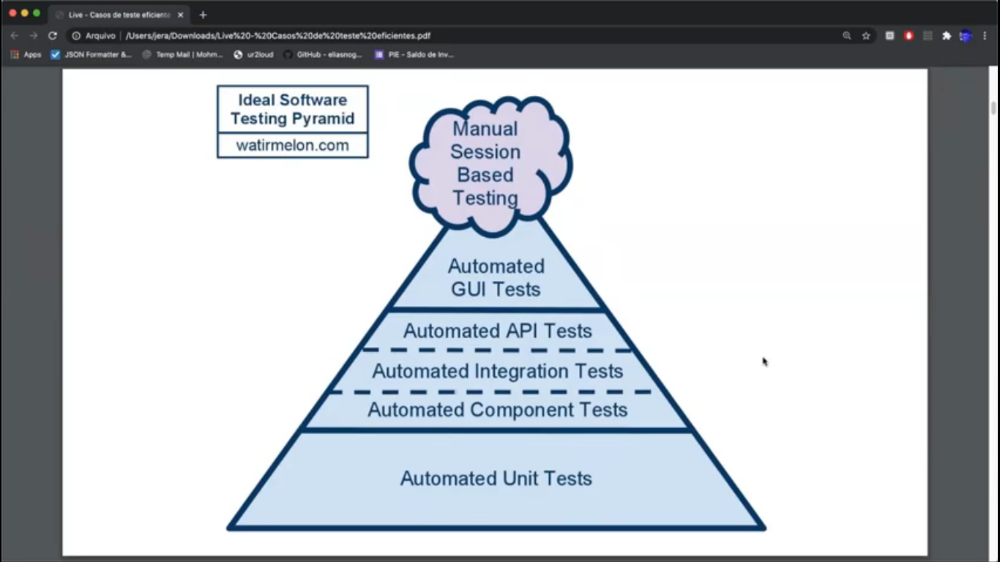
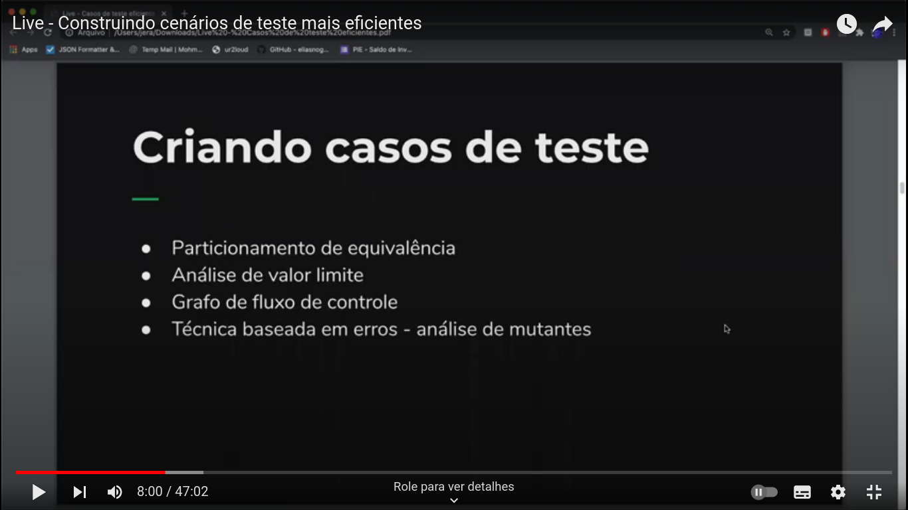
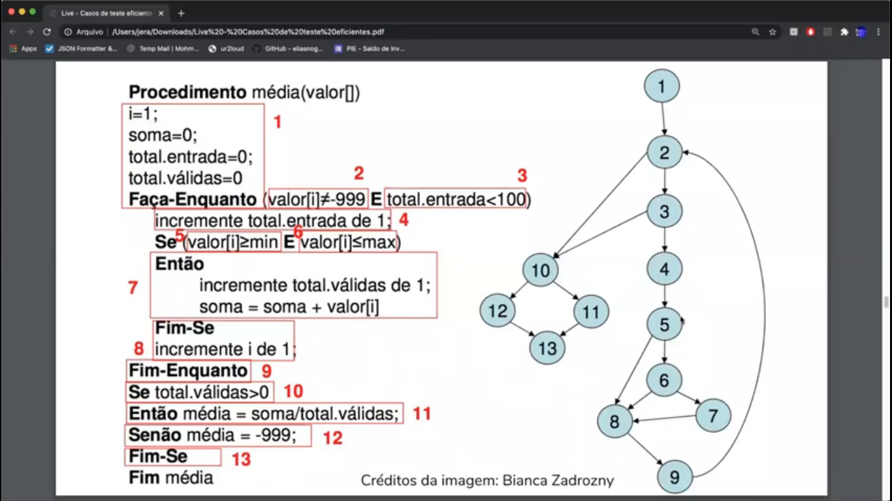

# Cenario de Teste

## Tecnicas de teste
  
  - teste
    - funcional (caixa preta)
      - voce considera o software como uma caixa preta
      - onde voce informa dados de entrada e coleta os dados de saida
      - ele é o mais utilizado para descobrir se ele se esta de acordo com o que voce documentou de acordo com os requisitos que voce leventou
  
    - estrutural (caixa branca)
      - voce considera o software como uma caixa branca
      - onde voce informa dados de entrada e consegue visualizar o fluxo de onde os dados iram passar até que ele lhe entregue o resultado
      - voce pode basear o teste no codigo ao inves de se basear apenas na especificação
    - regressão
      - o que esta construindo não esta estragando o que foi feito anteriormente
    - carga
      - para saber o quanto a aplicação consegue aguentar de usuario fazendo operaçãos 
    - estresse
      - deixa a ferramenta com o maximo que ela consegue e tanta fazer todo o fluxo nela nesse maximo
    - usabilidade
      - vai ate um pouco para os designers: é para saber se a ferramenta que esta sendo construida é interessante para o usuario e se faz sentido para resolver o problema dele
    - segurança
      - para saber se os dados que estão ali estão sendo acessados pelos usuarios devidos

    

----------------------------------------------------------------

## Criando casos de teste
  
  #### geralmente o teste
  ###### particionamento de equivalencia
  ###### analise valor limite
      - são usados em conjunto para garantir o teste
  
  - particionamento de equivalencia (tecnica de caixa preta)
    - agrupamento de ( pessoas, tipos ) por coisas que são equivalentes onde o resultado será igual para todos que estão dentro daquele grupo
    - exemplo:
      - uma aplicação em que o usuario deve ter entre 18 e 60 anos.
        - se o agrupamento for com base nessa informação, os grupos encontrados seram:
        - os menores de 18 anos
        - os que estão entre 18 e 60 anos
        - os maiores de 60 anos
      - usando essa tecnica de particionamento basta:
        - pegar um valor abaixo de 18
        - pegar um valor entre 18 e 60
        - pegar um valor acima de 60
        ---------------------------------------------------------------- 
  
    

  -----------------------------------------------------------------------
  - analise de valor limite
    - testar as bordas
      - teste um valor abaixo 17    59  anos
      - teste o proprio valor 18    60  anos
      - teste um valor acima  19    61  anos
  
  
  - grafo de fluxo de controle (tecnica de caixa branca)
    #### o grafo é utilizado com o teste unitario

    - é uma forma de representar todos os caminhos dentro do codigo
    - onde cada nó do codigo é um bloco básico da instrução
      - é possivel escolher um criterio de cobertura desse grafo
        - busca passar por todos os nós pelo menos uma vez
        - busca passar por todas as arestas pelo menos uma vez
  
  - analise de mutante (tecnica baseada em erros)
    - é uma forma de testar todas as combinações possiveis de um pedaço do codigo

----------------------------------------------------------------

  

----------------------------------------------------------------

## Oráculo de teste

  - é alguem ou algo que diz se alguma coisa ou valor passado esta correto ou não

  - no geral por utilizar um "oraculo humano"
    - onde nós mesmos dizermos se o resultado obtido é o resultado correto
  - ja o "oraculo sistemico" é uma ferramenta ou lib que colocamos em nosso projeto de nossa confiança que irá gerar dados aletórios para o teste e ela mesmo sera capaz de dizer se o resultado obtido é o resultado correto
    - essas ferramentas auxiliam gerando dados de entradas
      - forma aleatória (totalmente aleatoria)
      - forma semi-aleatório (seguindo alguns padrões)

  - CUIDADO COM OS TESTES QUE NÃO TESTAM NADA

- Exemplos de testes 'ruins'

- Teste ruim

Dado um usuario não cadastrado
Quando eu cadastrado o usuario
Então o usuario é cadastrado

- Teste bacana

Dado os usuarios do sistema
Quando eu informo nome, email e senha de um novo usuario
E o email ainda não existe no sistema
Então o novo usuario é cadastrado

-------------------------------

- Teste ruim

Dado a conta em bano de um usuario
Qunado eu deposito um valor na conta
Então o saldo da conta é atualizado

- Teste bacana

Dado uma conta de um usuario com 100 reais
Quando eu deposito 50 reais na conta
E verifico o saldo da conta
Então o saldo retornado deve ser 150 reais

- O MAIS IMPORTANTE É CONHECER O DOMINIO DA APLICAÇÃO PARA SABER O QUE REALMENTE DEVE SER TESTADO

- DEFINIR UM MINIMO DE COBERTURA DE TESTE

- TESTE PRIMEIRO CASO FELIZ
- TESTE CASOS ALTERNATIVOS

